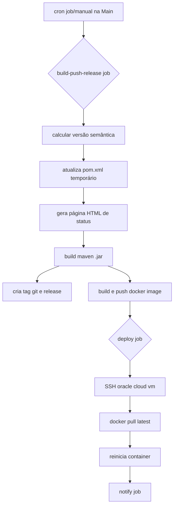

#  artigoEventos- API de Gestão de Eventos


Este repositório contém a implementação de uma API RESTful para gestão de eventos e participantes, desenvolvida como objeto de estudo para a aplicação de práticas modernas de **DevOps**, incluindo **Integração Contínua (CI)**, **Entrega Contínua (CD)** e **Versionamento Semântico Automatizado**.

---

## Sobre o Projeto

A aplicação é um sistema CRUD desenvolvido em **Java 21** com **Spring Boot 3**, utilizando **SQLite** para persistência de dados. O foco principal deste repositório não é apenas o código fonte, mas a infraestrutura de automação construída ao redor dele utilizando **GitHub Actions**.

### Funcionalidades da API
* Cadastro e Login de Usuários.
* Criação e Edição de Eventos.
* Gestão de Participantes.
* Upload de Imagens para eventos.
* **Endpoints de Monitoramento:**
    * `/api/teste/status`: Retorna status JSON da aplicação.
    * `/api/teste/deploy`: Página HTML gerada dinamicamente no build informando a versão e data do deploy.

---

## Tech Stack

* **Linguagem:** Java 21
* **Framework:** Spring Boot 3.5.7
* **Banco de Dados:** SQLite
* **Testes:** JUnit 5, Mockito
* **Qualidade de Código:** JaCoCo (Cobertura de Testes)
* **Containerização:** Docker
* **CI/CD:** GitHub Actions
* **Versionamento:** Semantic Versioning (Automatizado)
* **Infraestrutura:** Oracle Cloud (VM.Standard.E2.Micro)

---

## Arquitetura do Pipeline (CI/CD)

O projeto utiliza dois workflows principais para garantir a qualidade e a entrega do software.

### 1. Integração Contínua (`pr_check.yml`)
Acionado em todos os **Pull Requests** para a branch `main`.
* Compilação do projeto.
* Execução de Testes Unitários.
* Verificação de Cobertura de Código (JaCoCo).
* **Bloqueio:** O PR falha se a cobertura for menor que 80%.

### 2. Entrega Contínua (`deploy.yml`)
Acionado via **Schedule** (Diário/Semanal) ou manualmente. Implementa uma estratégia de **Versionamento Efêmero**.



#### Destaques da Automação:
* **Versionamento Automático:** Utiliza `paulhatch/semantic-version` para calcular a próxima versão (Major/Minor/Patch) baseada nos commits (Conventional Commits).
* **Deploy HTML Dinâmico:** Durante o build, um arquivo HTML é injetado na pasta `static` contendo a data exata e a versão do deploy, servindo como prova de atualização em `/api/teste/deploy`.
* **Notificações:** Alertas enviados ao Discord informando sucesso ou falha do pipeline.

---

## Como Rodar Localmente

### Pré-requisitos
* Java JDK 21
* Maven
* Docker (Opcional)

### Passos
1.  Clone o repositório:
    ```bash
    git clone [https://github.com/pedrovncs/artigoEventos.git](https://github.com/pedrovncs/artigoEventos.git)
    cd artigoEventos
    ```

2.  Execute a aplicação via Maven:
    ```bash
    ./mvnw spring-boot:run
    ```

3.  Acesse a API:
    * URL Base: `http://localhost:8080`
    * Swagger UI (se habilitado): `http://localhost:8080/swagger-ui.html`

### Rodando com Docker
```bash
docker build -t artigo-eventos .
docker run -p 8080:8080 artigo-eventos
```

---

## Autores

Trabalho desenvolvido para a disciplina de Projeto de Bloco: Engenharia Disciplinada de Softwares do Instituto Infnet.

- [@pedrovncs](https://www.github.com/pedrovncs)
- [@GabrielMeruzzi](https://github.com/GabrielMeruzzi)

---

## 📄 Licença

Este projeto está sob a licença MIT. Veja o arquivo [LICENSE](LICENSE) para mais detalhes.
